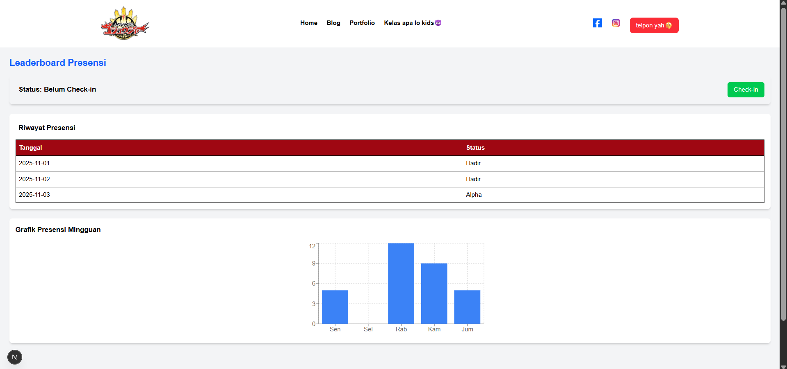

# latihan-ukl
tugas ini dikerjakan menggunakan next.js
siswa jurusan frontend di perintahkan untuk membuat tapilan halaman login, grafik kehadiran, dan riwayat presensi melalui next.js
1. login page
2. dashboard presensi

